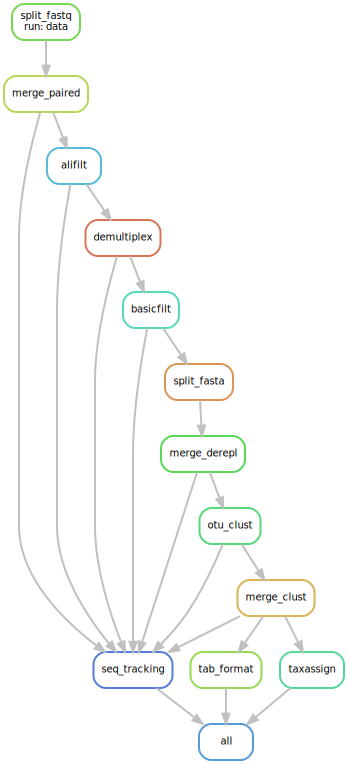

# OBIholo_pipeline
Metabarcoding pipeline for the HOLOBROM project data using the OBItools.

This pipeline starts from raw foward (R1) and reverse (R2) `.fastq` files and a `.tab` ngsfilter file.

This pipeline aims to respects the [FAIR](https://www.go-fair.org/fair-principles/) principles using [snakemake](https://snakemake.readthedocs.io/en/stable/#). 

# Description

Pipeline for raw NGS metabarcoding data processing using a combination of the OBItools, dada2 and sumaclust.

You'll find parameters used by the pipeline in the [config file](config/config.yaml).

DAG of the pipeline:

.

# Input

## Required

### Environment

In order to run this pipeline you need **snakemake**.

### Files

Raw illumina sequencing output for forward and reverse reads in `.fastq` format

Forward file named *XXX_R1.fastq* and reverse *XXX_R2.fastq*.

Additionally, you will need a text file named *XXX_ngsfilter.tab* as required by the [ngsfilter](https://pythonhosted.org/OBITools/scripts/ngsfilter.html) command of the obitools.

# Pipeline steps and tools

## I pairing

**a** - split fasq for faster processing

**OBItools** - [*obidistribute*](https://pythonhosted.org/OBITools/scripts/obidistribute.html)

options : 
  - `-n` : number of files to split in, `nfile` in [`config`](config/config.yaml). (between 2 and 1000).

**b** - align paired-end sequence

**OBItools** - [*illuminapairedend*](https://pythonhosted.org/OBItools/scripts/illuminapairedend.html)

**c** - merge output and remove temp files

basic cat and rm UNIX commands.

## II Filtering on alignment score

**OBItools** - [*obiannotate*](https://pythonhosted.org/OBItools/scripts/obiannotate.html)

options :
  - `-S` : expression used for annotation, ali:`good` if alignment score > `minscore` in [`config`](config/config.yaml).
  else `bad`.

**OBItools** - [*obisplit*](https://pythonhosted.org/OBItools/scripts/obisplit.html)

options :
  - `-t` : split according to a condition, here `ali = good`.
  
  - `-p` : prefix of the resulting files.

## III Demultiplexing

**a** - annotate average phred quality

**OBItools** - [*obiannotate*](https://pythonhosted.org/OBItools/scripts/obiannotate.html)

options : 
  - `-S` : expression used for annotation, Avgqphred:-int(math.log10(sum(sequence.quality)/len(sequence))\*10)

**b** - demultiplex according to the ngsfilter file

**OBItools** - [*ngsfilter*](https://pythonhosted.org/OBItools/scripts/ngsfilter.html)

options :
  - `-ngs` : ngs filter used for the demultiplexing in a `.tab` format.
  Check [input](##Required) for details about input format.
  - `-u` : name of the unassigned output file.

## IV Filtering on length, count and quality

**OBItools** - [*obiannotate*](https://pythonhosted.org/OBItools/scripts/obiannotate.html)

options : 
  - `-S` : expression used for annotation, GC_content:len(str(sequence).replace("a","").replace("t",""))*100/len(sequence)
  - `--length`: Adds attribute with seq_length as a key and sequence length as a value.
  
**OBItools** - [*obigrep*](https://pythonhosted.org/OBItools/scripts/obigrep.html) 

options :
  - `-l` : grep sequence of minimal length l.
  - `-s`: grep sequence pattern, '^[acgt]+$' to remove all sequence containing ambiguous nucleotides.
  - `-p`: grep sequence based on python boolean, avg_quality>{params.minqual} to retain sequence of avg quality > to minqual threshold.

## V Dereplication

**a** - Split for faster dereplication

**OBItools** - [*obiannotate*](https://pythonhosted.org/OBItools/scripts/obiannotate.html)

options :
  - `-S` : expression used for annotation, start:"hash(str(sequence))%{params.nfiles}", add an ID to nfiles groups of sequence.

**OBItools** - [*obisplit*](https://pythonhosted.org/OBItools/scripts/obisplit.html)

options :
  - `-t`: tag used to split the sequence file, here according to start.
  - `-p`: prefix to add to subfile name, "tmp".
  
**b** - dereplication

**OBItools** - [*obiuniq*](https://pythonhosted.org/OBItools/scripts/obiuniq.html)

options :
  - `-m` : attribute to merge, here sample.
  
**c** - merge back sequence files

cat all tmp files into a derepl file and remove them.

## VI OTUs formation

**sumaclust** - [*sumaclust*](https://git.metabarcoding.org/OBItools/sumaclust/-/wikis/home)

options :
   - `-t` : Score threshold for clustering (*e.g.* 0.97).
   - `-p` : Threads to use for clustering.
   
## VII OTUs cluster merging

**OBItools** - [*obiselect*](https://pythonhosted.org/OBItools/scripts/obiselect.html)

options :
   - `-c` : Attribute used to categorize the sequence records, *i.e.* `cluster`.
   - `-n` : Indicates how many sequence records per group have to be retrieved, *i.e.* `1`.
   - `--merge` : Attribute to merge, *i.e.* `sample`.
   - `-f` :  function used to score the sequence, *i.e.* `count` to have the reads per sample.
   - `-M` : maximize the `-f` function and order sample IDs in the headers of the sequences by their reads count.

## VIII Format output

**OBItools** - [*obitab*](https://pythonhosted.org/OBItools/scripts/obitab.html)

options :
  - `-n` : String written in the table for the not available values, NA.
  - `-d` : Removes column containing the sequence definition in the output tab file.
  - `-o` : Adds an extra column at the end of the table for the sequence itself.

## IX Assign taxonomy

**dada2** - [*assignTaxonomy*](https://rdrr.io/bioc/dada2/man/assignTaxonomy.html)

options : 
   - `refFasta` : Path to the `.fasta` database used to assign taxonomy to the sequence table.
   - `multithread` : Number of threads used to perform taxonomic assignment.

## X Track reads and sequence counts

For each step of the workflow, computes the total number of sequences and reads using basic bash commands.

Check `seq_tracking.R` and associated `reads_count.sh`, `reads_count_2.sh` and `count_dml` scripts.

## XI Benchmark 

For each step of the workflow, computes the amount of time and computing resources used and plot them.

Done with the `benchmark.R` script, get all benchmark info produced in the benchmark folder and plot them to have an overall assessment of the resources used for your computation.
